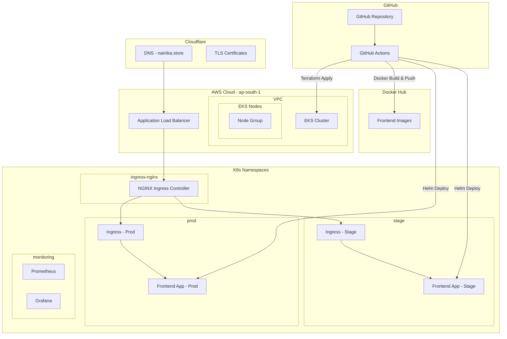

# Nainika Store - DevOps Infrastructure

[](https://github.com/zeus-dev/hrgf-task/actions/workflows/build-deploy-prod.yaml)
[](https://github.com/zeus-dev/hrgf-task/actions/workflows/terraform-apply.yaml)

A complete DevOps infrastructure project for deploying a frontend application on AWS EKS using modern CI/CD practices, monitoring, and security best practices.

## 🚀 Live Application

- **Production**: [https://nainika.store](https://nainika.store)
- **Staging**: [https://staging.nainika.store](https://staging.nainika.store)
- **Monitoring**: [https://grafana.nainika.store](https://grafana.nainika.store)

## 📋 Overview

This project demonstrates a complete cloud-native infrastructure setup featuring:

- **Infrastructure as Code**: Terraform for AWS EKS provisioning
- **Containerization**: Optimized Docker containers with security best practices
- **Kubernetes Orchestration**: Helm charts for application deployment
- **CI/CD Pipeline**: GitHub Actions for automated deployments
- **Monitoring Stack**: Prometheus & Grafana with pre-configured dashboards
- **Security**: Cloudflare TLS certificates, container security contexts
- **Multi-Environment**: Separate staging and production environments

## 🏗️ Architecture



## 🛠️ Technology Stack

- **Cloud Provider**: AWS (ap-south-1 region)
- **Infrastructure**: Terraform, Amazon EKS
- **Containerization**: Docker, Docker Hub Registry
- **Orchestration**: Kubernetes, Helm
- **CI/CD**: GitHub Actions
- **Monitoring**: Prometheus, Grafana
- **Ingress**: NGINX Ingress Controller
- **DNS & TLS**: Cloudflare
- **Security**: cert-manager, RBAC, Security Contexts

## 📦 Project Structure

```
.
├── frontend/                 # Frontend application
│   ├── src/                 # HTML/CSS/JS source code
│   ├── Dockerfile           # Multi-stage container build
│   ├── nginx.conf           # NGINX configuration
│   └── package.json         # Dependencies and scripts
├── terraform/               # Infrastructure as Code
│   ├── main.tf             # EKS and addon configurations
│   ├── vpc.tf              # VPC and networking
│   ├── eks.tf              # EKS cluster configuration
│   ├── variables.tf        # Input variables
│   ├── outputs.tf          # Output values
│   └── terraform.tfvars    # Environment-specific values
├── k8s/                    # Kubernetes configurations
│   ├── helm/frontend-app/  # Helm chart for application
│   ├── namespaces/         # Namespace definitions
│   ├── ingress/            # Ingress configurations
│   ├── monitoring/         # Prometheus & Grafana setup
│   └── tls/                # TLS certificate configurations
└── .github/workflows/      # CI/CD pipelines
    ├── terraform-apply.yaml
    ├── build-deploy-prod.yaml
    └── build-deploy-stage.yaml
```

## 🚀 Getting Started

### Prerequisites

- AWS CLI configured with appropriate permissions
- Docker installed locally
- kubectl installed
- Helm 3.x installed
- Terraform >= 1.0
- GitHub account with repository secrets configured

### Required GitHub Secrets

```bash
# AWS Credentials
AWS_ACCESS_KEY_ID
AWS_SECRET_ACCESS_KEY

# Docker Hub Credentials
DOCKER_HUB_USERNAME
DOCKER_HUB_ACCESS_TOKEN

# Cloudflare API Token (for TLS certificates)
CLOUDFLARE_API_TOKEN
```

### 1. Infrastructure Setup

```bash
# Clone the repository
git clone https://github.com/zeus-dev/hrgf-task.git
cd hrgf-task

# Setup Terraform backend (one-time setup)
cd terraform
aws s3api create-bucket --bucket nainika-terraform-state --region ap-south-1 \
  --create-bucket-configuration LocationConstraint=ap-south-1
aws s3api put-bucket-versioning --bucket nainika-terraform-state \
  --versioning-configuration Status=Enabled
aws dynamodb create-table --table-name terraform-state-lock \
  --attribute-definitions AttributeName=LockID,AttributeType=S \
  --key-schema AttributeName=LockID,KeyType=HASH \
  --billing-mode PAY_PER_REQUEST --region ap-south-1

# Uncomment the backend configuration in backend.tf
# Then initialize and apply Terraform
terraform init
terraform plan
terraform apply
```

### 2. Configure kubectl

```bash
aws eks update-kubeconfig --region ap-south-1 --name nasa-eks
```

### 3. Install Required Kubernetes Components

```bash
# Install NGINX Ingress Controller
helm repo add ingress-nginx https://kubernetes.github.io/ingress-nginx
helm upgrade --install ingress-nginx ingress-nginx/ingress-nginx \
  --namespace ingress-nginx --create-namespace

# Install cert-manager for TLS certificates
helm repo add jetstack https://charts.jetstack.io
helm upgrade --install cert-manager jetstack/cert-manager \
  --namespace cert-manager --create-namespace \
  --set installCRDs=true

# Apply TLS certificate configuration
kubectl apply -f k8s/tls/cloudflare-certificates.yaml

# Install monitoring stack
helm repo add prometheus-community https://prometheus-community.github.io/helm-charts
helm upgrade --install prometheus prometheus-community/kube-prometheus-stack \
  -f k8s/monitoring/prometheus-values.yaml \
  -n monitoring --create-namespace
```

### 4. Deploy Application

```bash
# Create namespaces
kubectl apply -f k8s/namespaces/namespaces.yaml

# Deploy to staging
helm upgrade --install frontend-app-stage ./k8s/helm/frontend-app \
  -f ./k8s/helm/frontend-app/value-stage.yaml -n stage

# Deploy to production
helm upgrade --install frontend-app-prod ./k8s/helm/frontend-app \
  -f ./k8s/helm/frontend-app/value-prod.yaml -n prod
```

## 🔄 CI/CD Pipeline

The project includes three automated workflows:

### 1. Infrastructure Pipeline (`terraform-apply.yaml`)
- **Trigger**: Changes to `terraform/` directory
- **Actions**: Validates, plans, and applies Terraform changes
- **Environment**: AWS EKS cluster provisioning

### 2. Production Deployment (`build-deploy-prod.yaml`)
- **Trigger**: Push to `main` branch with frontend changes
- **Actions**: Build → Test → Push to Docker Hub → Deploy to production
- **Environment**: Production namespace

### 3. Staging Deployment (`build-deploy-stage.yaml`)
- **Trigger**: Push to `develop` branch with frontend changes
- **Actions**: Build → Test → Push to Docker Hub → Deploy to staging
- **Environment**: Staging namespace

## 📊 Monitoring & Observability

### Pre-configured Grafana Dashboards

1. **NGINX Ingress Controller** (Dashboard ID: 14314)
   - Request rates, response times, error rates
   - Ingress resource monitoring

2. **Kubernetes Cluster Monitoring** (Dashboard ID: 7249)
   - Node resource utilization
   - Pod lifecycle and health

3. **Kubernetes Pods Monitoring** (Dashboard ID: 6417)
   - Container metrics and resource usage
   - Pod restart and failure tracking

4. **Node Exporter Full** (Dashboard ID: 1860)
   - System-level metrics for all nodes
   - CPU, memory, disk, and network monitoring

5. **Prometheus 2.0 Overview** (Dashboard ID: 3662)
   - Prometheus server health and performance
   - Query performance and storage metrics

### Access Monitoring

```bash
# Get Grafana admin password
kubectl get secret --namespace monitoring prometheus-grafana \
  -o jsonpath="{.data.admin-password}" | base64 --decode ; echo

# Port-forward for local access (if needed)
kubectl port-forward -n monitoring svc/prometheus-grafana 3000:80
```

## 🔒 Security Features

- **Container Security**: Non-root containers, read-only root filesystem
- **Network Security**: NGINX Ingress with proper security headers
- **TLS Encryption**: Cloudflare-managed SSL/TLS certificates
- **RBAC**: Kubernetes role-based access control
- **Secrets Management**: Kubernetes secrets for sensitive data
- **Image Security**: Multi-stage Docker builds with minimal attack surface

## 🌍 Environment Configuration

### Production Environment
- **URL**: https://nainika.store
- **Replicas**: 3 pods
- **Resources**: 500m CPU, 512Mi memory per pod
- **Auto-scaling**: Enabled (3-10 pods based on CPU usage)

### Staging Environment
- **URL**: https://staging.nainika.store
- **Replicas**: 2 pods
- **Resources**: 300m CPU, 256Mi memory per pod
- **Auto-scaling**: Disabled for cost optimization

## 🛠️ Local Development

```bash
# Run frontend locally
cd frontend
npm install
npm start
# Access at http://localhost:8080

# Build Docker image locally
docker build -t zeusdev27/myhello-app:local .
docker run -p 8080:8080 zeusdev27/myhello-app:local

# Test Kubernetes manifests
helm template ./k8s/helm/frontend-app -f ./k8s/helm/frontend-app/values.yaml
```

## 🔧 Troubleshooting

### Common Issues

1. **TLS Certificate Issues**
   ```bash
   # Check certificate status
   kubectl get certificates -A
   kubectl describe certificate nainika-store-cert -n prod
   ```

2. **Pod Not Starting**
   ```bash
   # Check pod logs
   kubectl logs -f deployment/frontend-app-prod -n prod
   kubectl describe pod <pod-name> -n prod
   ```

3. **Ingress Not Working**
   ```bash
   # Check ingress controller
   kubectl get pods -n ingress-nginx
   kubectl logs -f deployment/ingress-nginx-controller -n ingress-nginx
   ```

### Useful Commands

```bash
# Check cluster status
kubectl get nodes
kubectl get namespaces

# Monitor deployments
kubectl get deployments -A
kubectl get pods -A

# Check services and ingress
kubectl get svc -A
kubectl get ingress -A

# View resource usage
kubectl top nodes
kubectl top pods -A
```

## 🤝 Contributing

1. Fork the repository
2. Create a feature branch (`git checkout -b feature/amazing-feature`)
3. Commit your changes (`git commit -m 'Add amazing feature'`)
4. Push to the branch (`git push origin feature/amazing-feature`)
5. Open a Pull Request

## 📜 License

This project is licensed under the MIT License - see the [LICENSE](LICENSE) file for details.

## 👥 Maintainers

- **DevOps Team** - [devops@nainika.store](mailto:devops@nainika.store)

---

**Note**: This project is optimized for AWS free tier usage with cost-effective resource allocation. For production workloads at scale, consider adjusting instance types and resource limits accordingly.
