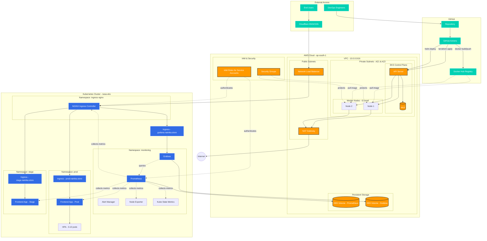
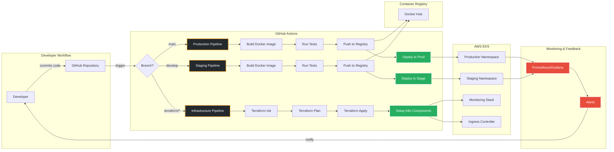
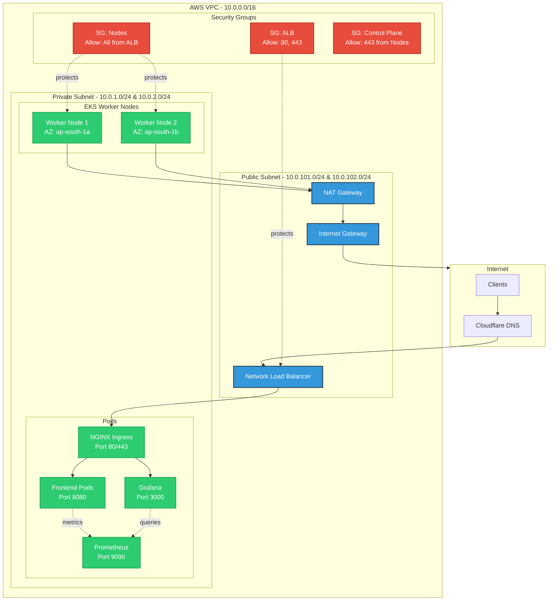
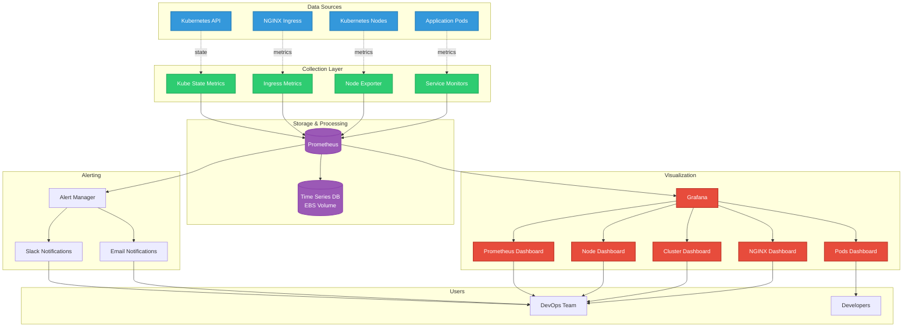
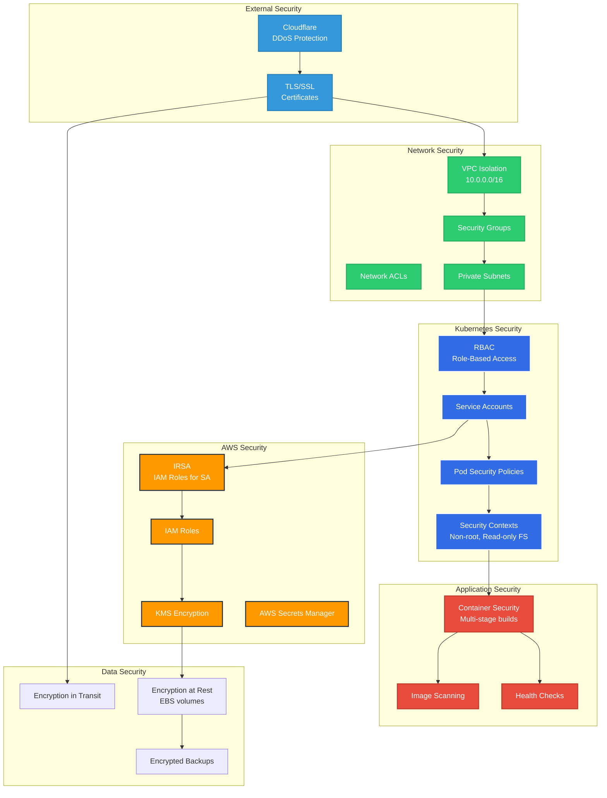
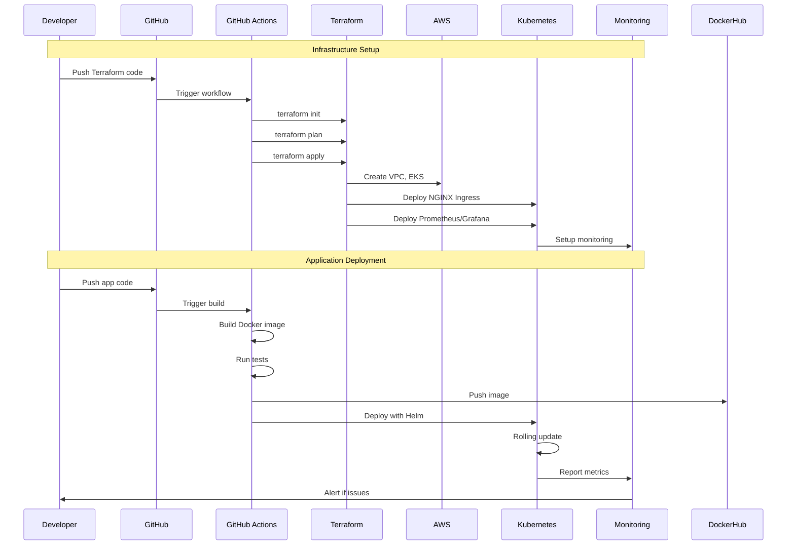

# Infrastructure Architecture

## Complete AWS EKS DevOps Architecture

## CI/CD Pipeline Flow

## Network Architecture

## Monitoring Architecture

## Security Architecture

## Deployment Flow

